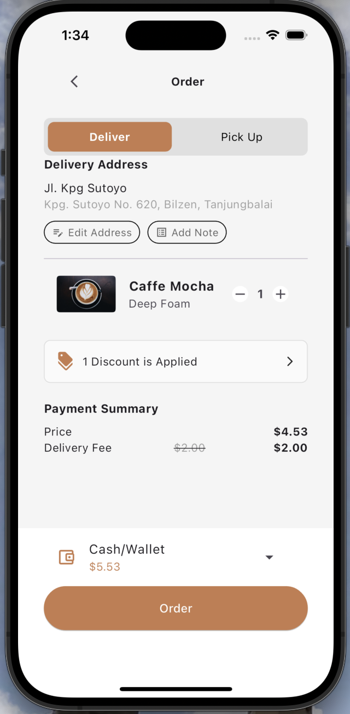

👋 Hi! I’m Hiba, a mobile developer working on :

### ☕ Coffee Shop App
I’m developing a custom app to enhance the coffee shop experience, blending design with functionality to make ordering, exploring the menu, and keeping up with promotions more convenient for users.

**Tech Stack**
-  SupaBase
-  Flutter

### ☕ Bike App
This is an app I built with one of my friend for some ui challenging like the 3D animation

**Tech Stack**
-  SupaBase
-  Flutter

### ☕ Adopt Animal App
In this app i was trying to use different way of state management (cubit or block , getX... )

**Tech Stack**
-  Firebase
-  Flutter